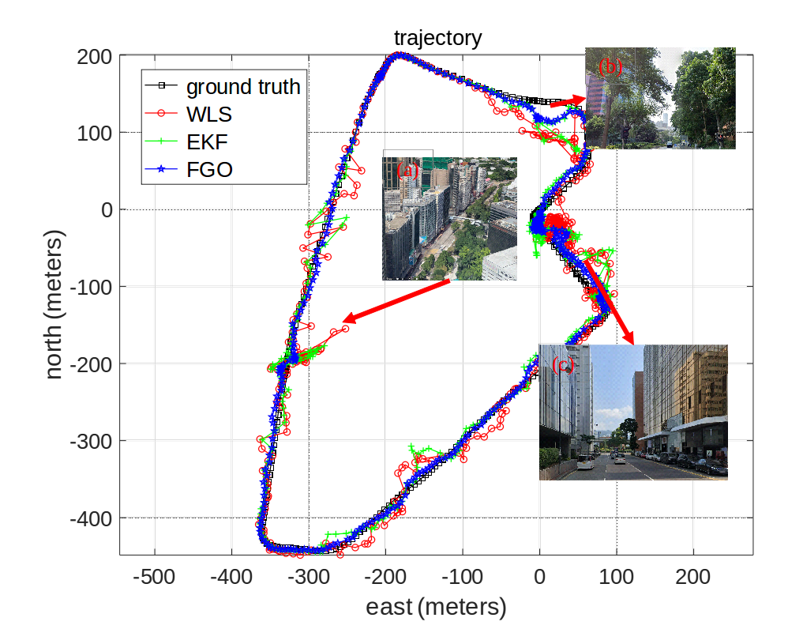
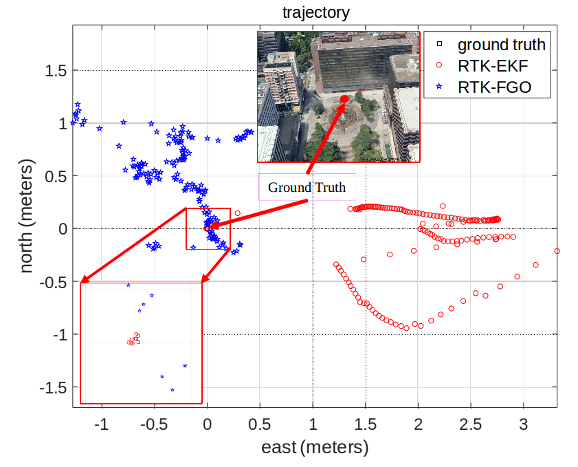

# GraphGNSSLib
### An Open-source Package for GNSS Positioning and Real-time Kinematic Using Factor Graph Optimization

This repository is the implementation of the open-sourced package, the GraphGNSSLib, which makes use of the factor graph optimization (FGO) to perform the postprocessing of GNSS positioning and real-time kinematic (RTK) positioning. In this package, measurements from the historical and current epochs are structured into a factor graph which is then solved by non-linear optimization. The package is based on C++ which is compatible with the robot operation system (ROS) platform. Meanwhile, this package combines the RTKLIB (**[version: 2.4.3 b33](http://www.rtklib.com/)**) to read/decode the GNSS [RINEX](https://en.wikipedia.org/wiki/RINEX) files. Users from Robotics field can easily have access to GNSS raw data for further study. We are still improving the code readibility with the hope that this package can benefit the research community.

**Important Notes**: 
  - Be noted that the **GNSS Positioning** mentioned throughout the package means estimating the positioing of the GNSS receiver based on the combination of pseudorange and Doppler measurements uisng FGO.
  - Be noted that the **GNSS-RTK Positioning** mentioned throughout the package means estimating the positioing (float solution) of the GNSS receiver based on the combination of double-differenced pseudorange, carrier-phase and the Doppler measurements using FGO. Finally, the ambiguity is resolved using LAMBDA algorithm via epoch-by-epoch manner.

**Authors**: [Weisong Wen](https://weisongwen.wixsite.com/weisongwen), [Li-ta Hsu](https://www.polyu-ipn-lab.com/) from the [Intelligent Positioning and Navigation Laboratory](https://www.polyu-ipn-lab.com/), The Hong Kong Polytechnic University

**Related Papers:** (paper is not exactly same with code)
  - Wen Weisong., Hsu, Li-Ta.* **Towards Robust GNSS Positioning and Real-Time Kinematic Using Factor Graph Optimization**, *ICRA 2021*, Xi'an, China. ([**Paper Link**](https://arxiv.org/ftp/arxiv/papers/2106/2106.01594.pdf)) ([**Video Link**](https://www.youtube.com/watch?v=rSrXFFv9PGs&t=312s)) (**Accepted**)

*if you use GraphGNSSLib for your academic research, please cite our related [papers](https://arxiv.org/ftp/arxiv/papers/2106/2106.01594.pdf)*

<p align="center">
  
</p>

<center> Software flowchart of GraphGNSSLib, more information please refer to our paper.</center>

## 1. Prerequisites
### 1.1 **Ubuntu** and **ROS**
Ubuntu 64-bit 16.04, ROS Kinetic. [ROS Installation](http://wiki.ros.org/ROS/Installation). We only test it on Ubuntu 16.04 with ROS Kinetic. 

### 1.2. **Ceres Solver**
Follow the following instructions to install Ceres-solver instead of using the latest version of Ceres-solver.

**Step 1**: Download the [Ceres-solver](https://github.com/weisongwen/GraphGNSSLib/tree/master/support_files) which is compatible with GraphGNSSLib. 

**Step 2**: make and install
```bash
sudo apt-get install cmake
# google-glog + gflags
sudo apt-get install libgoogle-glog-dev
# BLAS & LAPACK
sudo apt-get install libatlas-base-dev
# Eigen3
sudo apt-get install libeigen3-dev
# make Ceres-solver
mkdir ceres-bin
cd ceres-bin
cmake ../ceres-solver
sudo make -j4
sudo make test
sudo make install
```

### 1.3. **Extra Libraries**
```bash
sudo apt-get install ros-kinetic-novatel-msgs
```
## 2. Build GraphGNSSLib
Clone the repository and catkin_make:
```bash
mkdir GraphGNSSLib/src
cd ~/GraphGNSSLib/src
mkdir result
git clone https://github.com/weisongwen/GraphGNSSLib.git
cd ../
# if you fail in the last catkin_make, please source and catkin_make again
catkin_make
source ~/GraphGNSSLib/devel/setup.bash
catkin_make
```
(**if you fail in this step, try to find another computer with clean system or reinstall Ubuntu and ROS**)

## 3. Run GNSS positioning via FGO using dataset [UrbanNav](https://www.polyu-ipn-lab.com/download)   
The GNSS positioning via FGO is validated using dynamic dataset collected near TST of Hong Kong. Several parameters are as follows:
  - GPS second span: **46701** to **47185**
  - satellite system: **GPS/BeiDou**
  - measurements considered: pseudorange and Doppler measurements

please enable the following in rtklib.h
```bash
#define RTK_FGO 0
```
- Solution 1 to run the GNSS positioning Demo
  ```bash
  source ~/GraphGNSSLib/devel/setup.bash
  # read GNSS raw data and publish as ROS topic
  # we provide several datasets, enjoy it!
  roslaunch global_fusion dataublox_TST20190428.launch
  # run pseudorange and doppler fusion
  roslaunch global_fusion psr_doppler_fusion.launch
  ```
<p align="center">
  
</p>
<center> Trajectories of three methods (GNSS positioning using WLS with the red curve, GNSS positioning using EKF with the green curve, and GNSS positioning using FGO with blue curve throughout the test. The x-axis and y-axis denote the east and north directions, respectively</center>


## 4. Run GNSS RTK-FGO using static dataset   
The GNSS RTK-FGO is validated using static dataset collected near TST of Hong Kong. Several parameters are as follows:
  - GPS second span: **270149** to **270306**
  - satellite system: **GPS/BeiDou**
  - measurements considered: double-differenced pseudorange and carrier-phase measurements, Doppler measurements

please enable the following in rtklib.h
```bash
#define RTK_FGO 1
```
- Solution 1 to run the RTK-FGO Demo
  ```bash
  source ~/GraphGNSSLib/devel/setup.bash
  # read GNSS raw data and publish as ROS topic
  roslaunch global_fusion dataublox_TST20200603.launch
  # run GNSS RTK
  roslaunch global_fusion psr_doppler_car_rtk.launch
  ```
<p align="center">
  
</p>
<center> Trajectories of three methods (RTK-EKF with the red dots and RTK-FGO with the blue dots throughout the test. The x-axis and y-axis denote the east and north directions, respectively.</center>


## 5. Acknowledgements
We use [Ceres-solver](http://ceres-solver.org/) for non-linear optimization and [RTKLIB](http://www.rtklib.com/) for GNSS data decoding, etc. Some functions are originated from [VINS-mono](https://github.com/HKUST-Aerial-Robotics/VINS-Mono). The [rviz_satellite](https://github.com/nobleo/rviz_satellite) is used for visualization. We appreciate the help and discussion from [Tim Pfeifer](https://www.tu-chemnitz.de/etit/proaut/en/team/timPfeifer.html) which inspired me to finish this work. If there is any thing inappropriate, please contact me through 17902061r@connect.polyu.hk ([Weisong WEN](https://weisongwen.wixsite.com/weisongwen)).

## 6. License
The source code is released under [GPLv3](http://www.gnu.org/licenses/) license. We are still working on improving the code reliability. For any technical issues, please contact Weisong Wen <17902061r@connect.polyu.hk>. For commercial inquiries, please contact Li-ta Hsu <lt.hsu@polyu.edu.hk>.
